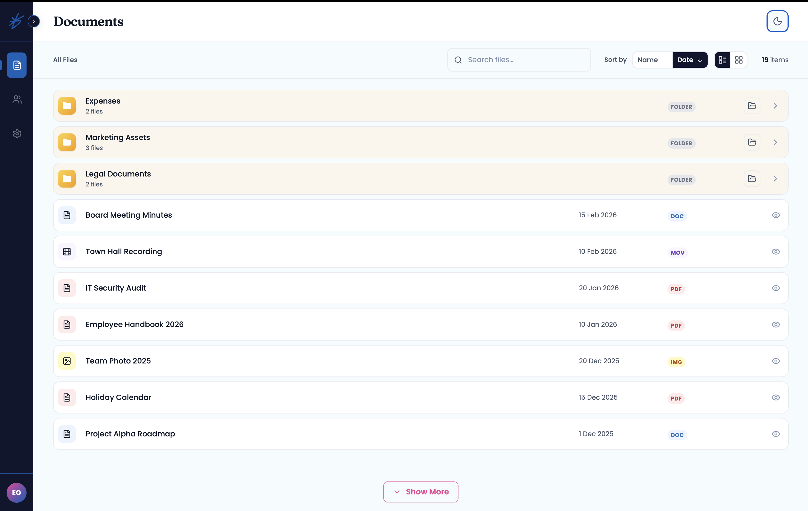
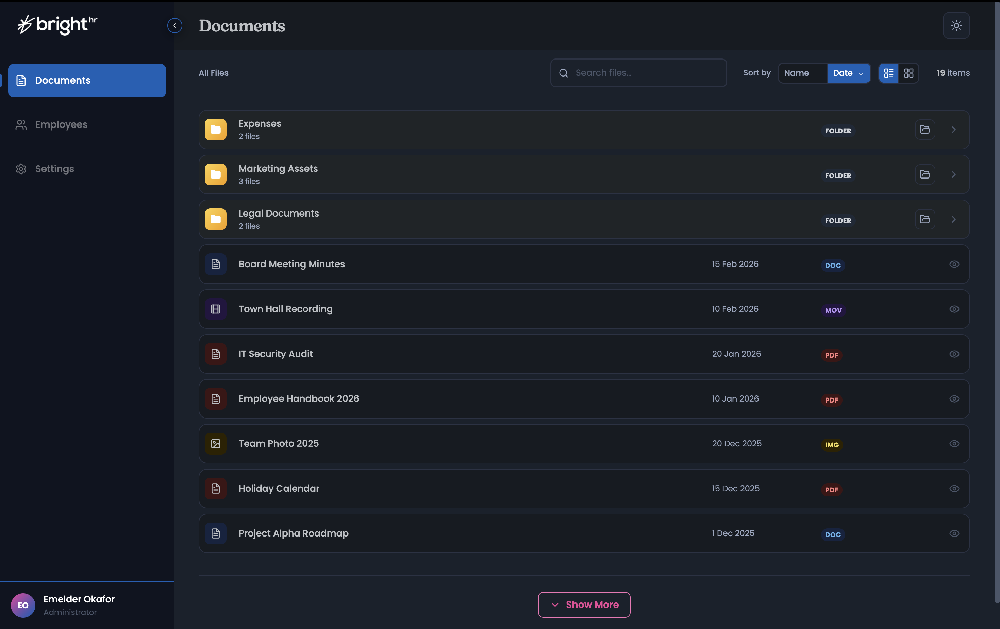

# 📂 Document Viewer

| Light Mode                                  | Dark Mode                                 |
| ------------------------------------------- | ----------------------------------------- |
|  |  |

A modern, responsive document management interface to provide a seamless way for users to browse files and folders. The application is designed to be fast, user-friendly, and visually consistent across all devices.

**🚀 Live Demo:** [https://brighthr-doc-viewer.vercel.app/](https://brighthr-doc-viewer.vercel.app/)

---

## ✨ Features

- **Folder Navigation:** Users can open folders to view contents or use the "breadcrumb" links at the top to navigate back through the folder hierarchy.
- **Folder Expansion:** I added the ability to view folder contents via a dropdown toggle or by clicking the folder icon directly.
- **Search & Sorting:** I implemented a real-time search bar to filter files by name. Users can also sort the list by **Name** or **Date** in both ascending and descending order.
- **List & Grid Views:** I included a toggle so users can choose their preferred layout—either a detailed list for information-density or a visual grid for easier browsing.
- **Pagination Control:** I used "Show More" and "Show Less" buttons to give users control over how many items are displayed on the screen at one time.
- **Theme Support:** I integrated a Dark and Light mode toggle for an improved user experience. The app remembers your preference even after you close your browser.
- **Visual Consistency:** I utilized automated testing (Visual Regression) to significantly reduce production errors and ensure a polished UI.

---

## 🛠 Technology Stack

- **Core:** React 19 (for a modern, fast, and reactive user interface).
- **Build Tool:** Vite (for near-instant development builds and optimized loading).
- **Language:** TypeScript (to ensure the code is reliable, typed, and error-free).
- **Styling:** Tailwind CSS (leveraging CSS variables for easy theme management).
- **State Management:** Context API (to handle theme and navigation state globally).
- **Icons:** Lucide React (for clean, consistent, and lightweight vector icons).
- **Testing:** Playwright (for automated end-to-end and visual regression tests).

---

## 🚀 How to Run the App

I have made it easy to get this project running on your local machine.

### 1. Clone the Project

First, download the code to your computer:

```bash
git clone https://github.com/Meldy2503/brighthr-doc-viewer.git
cd brighthr-doc-viewer

```

### 2. Install Dependencies

Install the necessary tools and libraries:

```bash
npm install

```

### 3. Start Development Mode

Run this command to open the app in your browser:

```bash
npm run dev

```

The app will be available at **http://localhost:5173**.

---

## 🧪 Testing

I included a testing suite to ensure the application remains stable during development.

- **Run Background Tests:** `npm run test:e2e`
- **Open the Test UI:** `npm run test:e2e:ui` (This allows you to see the automated browser performing the tests in real-time).
- **View Results:** `npm run test:e2e:report`

---

## 🗺 Future Updates & Approach

For the features currently in the roadmap, I have outlined my intended technical approach below:

1. **Multi-Select Option & Batch Deletion**

- **Approach:** I will use a `Set` in the component state to track selected file IDs for high-performance lookups and toggle a floating "Delete" action bar when the selection is not empty.

2. **Read/Unread Tracking**

- **Approach:** I plan to add an `isRead` property to the file data that toggles to `true` upon a click event, using storage to persist these states and a CSS-based blue dot indicator on the files for visual clarity.

---

## 🏗 Project Structure

```text
├── e2e/              # Automated test files and design snapshots
├── src/
│   ├── assets/       # Static files like logos and images
│   ├── components/
│   │   ├── Layout/   # Main shell (Sidebar, Navbar)
│   │   ├── documents/# Reusable components for the document page (FileRow, FileList)
│   │   └── ui/       # Shared UI pieces (Inputs, Modals)
│   ├── context/      # State management for Theme and Navigation
│   ├── data/         # Mock data for the file system
│   ├── pages/        # Main screen components (Documents Page, Settings)
│   ├── types/        # TypeScript definitions
│   ├── utils/        # Helper functions
│   └── main.tsx      # Main application entry point
├── tailwind.config.js
└── package.json

```

---
